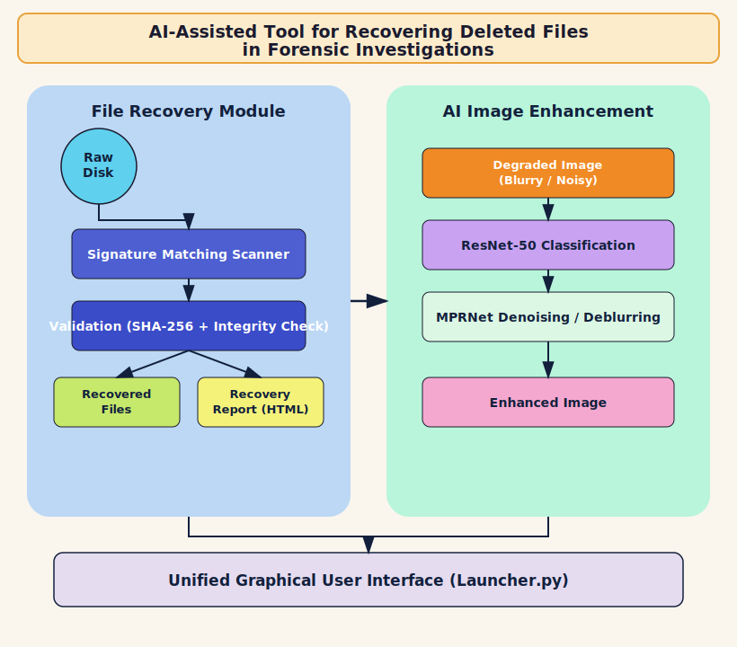

# Signature-Carving-and-Image-Restorer

Recovers deleted JPEG/PNG images from raw disk sectors via signature-based carving, then classifies and restores degraded (blurry/noisy) images using a fine-tuned ResNet-50 + MPRNet — all through a unified PyQt5 GUI for digital forensics and personal data recovery.
---

## Overview

Deleted images are often unrecoverable through conventional tools once file system metadata (file tables, directory entries) is missing or corrupted — a common scenario in both accidental data loss and forensic investigations. This tool solves that with a two-stage pipeline:

1. **File Recovery Module** — Scans a drive (USB, disk partition, or full disk) at the raw sector level and reconstructs deleted JPEG/PNG files purely from header/footer byte signatures, independent of file system metadata. Recovered files are integrity-checked (SHA-256 + image validation), sorted into valid/corrupted folders, and summarized in an HTML report.
2. **AI Image Enhancement Module** — Recovered (or any existing) images are classified as **blurry**, **noisy**, or **clean** using a fine-tuned ResNet-50 model, and degraded ones are automatically restored using **MPRNet**, a multi-stage deep restoration network — without hallucinating new image content.

---

## Features

- Multiple recovery modes: USB Scan, Disk Partition Scan, Full Disk Scan, and Existing Images (no recovery).
- Signature-based carving for JPEG (JFIF/Exif/SPIFF/Adobe/JPEG-LS) and PNG, independent of file system metadata.
- SHA-256 hashing and Pillow-based integrity verification, with automatic isolation of corrupted files.
- Auto-generated HTML recovery report (with plain-text fallback).
- ResNet-50 based multi-label classification (blurry / noisy / clean) with per-class confidence scores.
- MPRNet-based deblurring and denoising, applied only to flagged images.
- Automatic admin-privilege detection/elevation for raw disk access.
- Single unified GUI launcher for both Recovery and AI Enhancement.
- Live scan progress, status logs, and stop/cancel support.

---

## Architecture

<p align="center">
  
</p>

---

## How to Run

### Requirements

- Windows OS (raw disk access APIs in `enumerator.py` / `permissions.py` are Windows-specific)
- Python 3.9 – 3.11
- Administrator privileges (required for raw disk/sector access)

### Install dependencies

Versions below match what was current around the project's build date (April 2025):

```bash
pip install PyQt5==5.15.10 pillow==10.3.0 pywin32==306 WMI==1.5.1 psutil==5.9.8
pip install torch==2.3.0 torchvision==0.18.0 numpy==1.26.4
```

*(Use a CUDA-enabled `torch`/`torchvision` build for GPU-accelerated classification/restoration — see [pytorch.org](https://pytorch.org/get-started/previous-versions/#v230).)*

### Run the application

Both the **Recovery** module and the **AI Image Enhancement** module are launched from a single entry point:

```bash
python Launcher.py
```

From the launcher, choose:
- **Recover Images** → scan a target device, verify integrity, and generate a recovery report.
- **AI Image Enhancement** → classify images and repair degraded ones with MPRNet.

> If not already running as administrator, the tool will prompt for elevation automatically.

### (Optional) Retrain the classifier

```bash
python train.py
```

Expects a dataset directory structured as `./dataset/{blurry,noisy,none}/*.jpg`.

---

## Reference

- MPRNet — Multi-Stage Progressive Image Restoration: [https://github.com/swz30/MPRNet](https://github.com/swz30/MPRNet)
